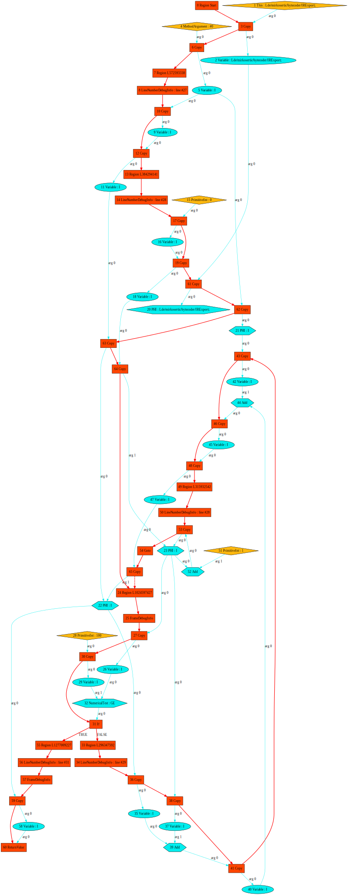

# Intermediate representation

The Bytecoder internal intermediate representation is basically a directed graph. The key idea behind this is described 
[in this paper](core/src/main/java/de/mirkosertic/bytecoder/graph/c2-ir95-150110.pdf).

Given this Java source code:

```
@Test
public void testSimpleLoop() {
    for (int i=0;i<10;i++) {

    }
}
```

the following intermediate representation graph is generated:



This graph combines data flow analysis and control flow into one big graph. Using this graph makes data and
control flow dependencies explicit and lays foundation for a variety of optimizations that can be performed on it to
either reduce code size or improve execution speed.

Part of the compiler optimization is the [relooper step](core/src/main/java/de/mirkosertic/bytecoder/relooper/paper.pdf).
Relooping tries to recover high level control flow constructs from the intermediate representation. This step eliminates
the needs of GOTO statements and thus allows generation of more natural source code, which in turn can be easier read
and optimized by Web Browsers or other tools.